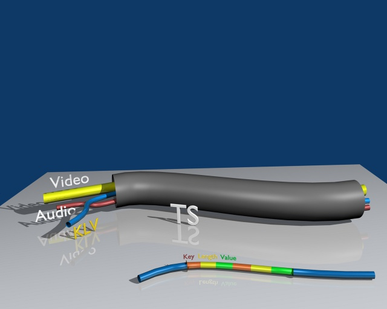

# KLV

## Introduction

**KLV** (Key-Length-Value) is a data encoding standard used for binary data byte-packing and metadata embedding into video feeds. Data is encoded into Key-Length-Value triplets, where **Key** identifies the data, **Length** specifies the data's length, and **Value** is the data itself. It is defined in **SMPTE 336M-2007** (Data Encoding Protocol Using Key-Length Value), approved by the Society of Motion Picture and Television Engineers. KLV encoding protocol defines a data structure which is independent of the application or transportation method used.

**MISBCore** SDK has an integrated KLV encoder/decoder library, so for generic **STANAG 4609** metadata tasks there is no need to deal with KLV explicitly—the user either provides a KLV‑encoded data buffer on the client side and gets the decoded metadata back, or on the server side supplies structured (JSON) metadata and receives a KLV‑encoded buffer.

## Encoding/decoding metadata for Unmanned Air System (UAS)
Unmanned Air Systems use two types of KLV‑encoded metadata. Universal Data Set (UDS)—the 16‑byte key with basic encoding rules (BER) formatted length and data value—is suitable where bandwidth is not a concern. However, transmitting the 16‑byte universal key quickly consumes available bandwidth. UAS platforms typically use wireless channels where bandwidth for metadata is limited. Because of this, it is preferable to use a Local Data Set for transmission over a UAS datalink. A Local Data Set can use a 1, 2, or 4‑byte key with a 1‑, 2‑, 4‑byte, or BER‑encoded length. For more information about using KLV in UAS applications, see [KLV in UAS applications](./klv-in-uas.md)

[1] SMPTE ST 336:2017 Data Encoding Protocol Using Key-Length-Value.  
[2] MISB MISP-2019.1: Motion Imagery Handbook, Nov 2018.