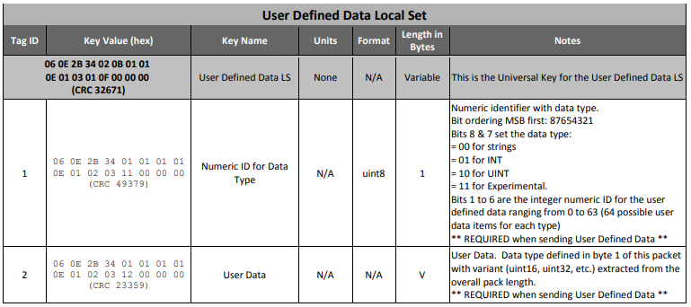

# Getting started with MISB 0806

**MISB ST 0806** defines a Local Set (LS) to be used with a Remote Video Terminal (**RVT**).  
Users of the **ROVER** (Remotely Operated Video Enhanced Receiver) require additional metadata elements unique to its mission needs than are specified in **MISB ST 0601**. The
purpose of this Standard is to formalize a method of communicating with a Remote Video
Terminal, and create a configuration-managed metadata standard to meet its needs with
minimal impacts on ST 0601 users.  

## Nesting in MISB601

In most cases, **MISB ST 0806** will be used as a nested set of the parent **MISB 601** packet.  
Here is an example of encoding / decoding such data:  

Let's assume we have the following metadata:  

```js
{
	"2": "2008-10-24T00:13:29.913",
	"3": "MISSION01",
	"65": 13,
    "73": {
        "2": "2008-10-24T00:13:29.913",
        "3": 25,
        "4": 20,
        "6": 1000,
        "7": 4000,
        "8": 4,
        "9": 13090,
        "10": "H.264",    
    } 
}
```

To encode the MISB601 payload along with the RVT data, we can create an instance of **MISB601** and use it for packet creation


```C#
var misb601 = new MISB601();
var buf = misb601.EncodePacket(pckt);
```

To decode the data, we call **DecodePacket** method.


```C#
var pckt = misb601.DecodePacket(buf);
```

If you only need **RVT** payload, use EncodePayload / DecodePayload methods instead.

## RVT LS Subordinate Sets

The RVT LS uses a subordinate Local Sets:  

- Point of Interest (POI) Local Set  
- Area of Interest (AOI) Local Set  
- User-Defined Local Set  

As the subordinate set item may appear more than once within a RVT Local Set, in order to deal with tag duplication,  **MisbCore SDK** will accept an array of subordinate Local Sets. For example:  

```js
{  
    2: '2008-10-24T00:13:29.913',
    3: 10,
    4: 10,
    11: [
            {
               User Defined LS 1 ... 
            },
            {
               User Defined LS 2 ... 
            }
        ],
     12: [
            {
               Point of Interest LS 1... 
            },
            {
               Point of Interest LS 2... 
            }
        ]
}
```

In case the subordinate Local Set is only appears once, it is possible to use either ***key:value*** or ***key:[value]*** format.

```js
{  
    2: '2008-10-24T00:13:29.913',
    3: 10,
    4: 10,
    11: {
        User Defined LS 1 ... 
    },
    12: {
        Point of Interest LS 1... 
    }
}
```

## User-Defined Data Local Set



The Local Set may not be used to substitute for any valid KLV element or construct defined in any other MISB specification.  

The content of the **User-Defined LS** is determined out of the field.  
Bits 1 to 6 of the Numeric ID for Data Type define the **descriptive key**, which in its turn defines the data type.  


### Using arbitrary byte array
This method allows passing arbitrary binary data. SDK in that case is data agnostic, it just passed the data from server to the client. It is a client responsibility to decode and interpret the data.
To pass the binary data, we use byte array encoded as base64 string.

>Note, **MISBCore** will extract the byte array and send binary data (and not the base64 encoded string)! 

Let's assume we have the following metadata:  

```C#
byte [] data = new byte[] {0x01, 0x02, 0x03, 0x04};
String dataStr = Base64.encodeBase64String(data);
```

This will give us *"AQIDBA=="*, so we can send it in **tag 2**.


```js
{
	"2": "2008-10-24T00:13:29.913",
	"3": "MISSION01",
	"65": 13,
    "73": {
        "7": 4000,
        "11": {
            1: 1,
            2: "AQIDBA=="    
        }   
    } 
}
```

```C#
var misb601 = new MISB601();
var buf = misb601.EncodePacket(pckt);
```

At the client side, in order to get the data back, we decode the packet using **Base64.FromBase64String()**

### Using the plugin with the descriptive schema for encoding and decoding user-defined data

**MisbCore** supports plugins for encoding and decoding data, making it possible to use user-defined data seamlessly without needing to rebuild the application that uses the SDK. A typical workflow for this would be as follows:


- The vendor responsible for metadata encoding creates and distributes a plugin along with a descriptive schema.
- The plugin module should be copied to the plugins directory on either the encoder or client side.
- Metadata is encoded with a unique ID and placed in an RVT tag according to MISB 806 standards.
- If the client-side has plugins installed, they will be loaded into the **MisbCore** module.
- When the metadata encoder encounters an RVT packet with a User Data (tag 2) metadata field passed as an object, it will check if it is possible to apply one of the existing plugins to encode the data, otherwise, if it receives the string, it will be processed as an EncodeBase64String string.
- When the metadata decoder encounters an RVT packet with a user-defined metadata field, it will check if it is possible to apply one of the existing plugins to decode the data.
- If a suitable plugin is found, it will be used to decode the metadata, and a properly structured JSON object will be returned in the corresponding RVT packet.
- If no match is found, the decoder will return a Base64String encoded binary buffer.


For example, lets define a **User-Defined LS** and assign it a GUID, to make it unique:  

Sample User Data Local Set:  

| Data tag  |  Units   |  Format   | Klv Len   |   Min    |   Max        |  Resolution        |  Description                                 |
|-----------|:--------:|:---------:|----------:|---------:|:------------:|-------------------:|:------------------------------------------- |
|     0     |     -    |    -      |     V     |     -    |     -        |      -             | Reserved id. If not present, SDK will try to use the first existing plugin (not recommended)                                |
|     1     |  m/s     |  uint8    |     1     |    0     |   255        |     1              | Speed, m/s                                  |  
|     2     |  degrees |  float64  |     4     |  -90     |   90         | ~42 nano degrees   | Latitude,  degrees                          |
|     3     |  degrees |  float64  |     4     |  -180    |   180        | ~84 nano degrees   | Longitude, degrees                          |
|     4     |  meters  |  float64  |     2     |  -900    |   19000      | ~0.3 meters        | Altitude, meters                            |
|     5     |  -       |  string   |     V     |    -     |     -        |      -             | Designator, string                          |
|     6     |  -       |  uint16   |     4     |    0     |   65535      |      -             | Counter, integer                            |

The data will follow other MISB standards convention and will be encoded as klv triplets, allowing the value mapping and variable length encoding to optimize the required bandwidth.  
Proprietary data conversion formulas can be used (and should be a part of the **descriptive schema** definition)


#### User-Defined Data Local Set encoding

In order to pass the user data defined by the above schema, user should provide a **json** packet to the encoding method of the library:  

```js
{  
    2: '2008-10-24T00:13:29.913',
    11: [
            {
                1: 0x81,
                2: { 
                    0: "AMrJFxsvK5",
                    1: 2,
                    2: 60.176822966978335,
                    3: 128.42675904204452,
                    4: 14190.7195,
                    5: "Test",
                    6: 1
                }  
            }
        ],
}
```

>Note:
- **Misbcore** will try to locate and use metadata encoding plugin if RVT object contains json object in **Tag 2** of Used Defined Local Set.  
- **Tag 0** of the user-defined metadata object contains unique **id**. Can be any string. For example, can be generated using https://shortunique.id/  
When **MisbCore** receives a json packet with user-defined data and data type id (in  **Tag 0**) and no plugin with such an id can be found, the encoding of the user-defined data will fail.

#### User-Defined Data Local Set decoding. 

When client receives the RVT User-Defined Data Local Set and have a relevant decoder plugin installed, the SDK will provide the output as described above.   
It the client does not have the key, but supports the RVT decoding, it will get, along with other standard tags/values an array of **uint** values (so it would be MISB 0806 compliant).


### Using User-Defined Data Local Set plugins in applications

Please see [STPlayer RVT Plugin](./stplayer-rvt-user-defined.md) for more info on how to use plugins in the applications.

#### Plugin development 

**MisbCore** can use plugins to seamlessly integrate 3rd party data sets.

Plugins allow you to extend the functionality of User-Defined Data encoder and decoder without touching MisbCore SDK or encoding / decoding applications that use them.

For more info on Plugin development see [Plugin development](./pluginDevelopment.md) 