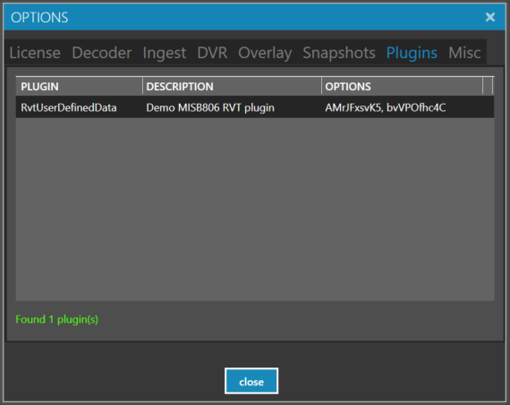
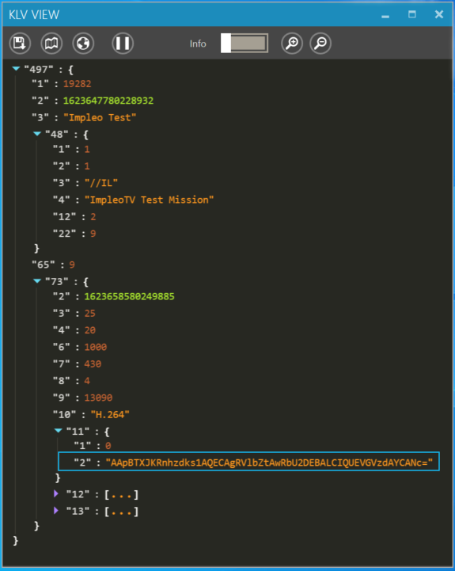
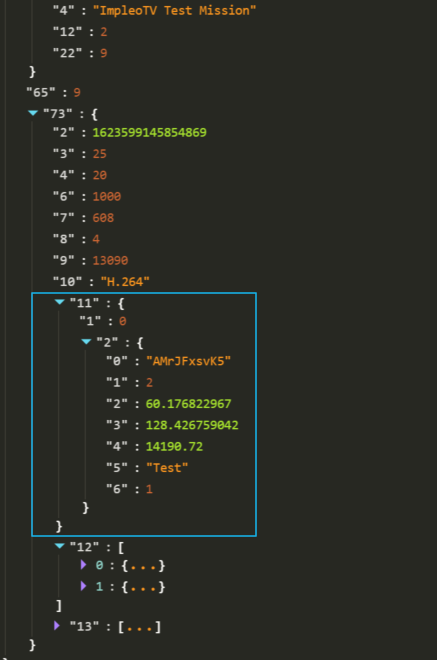
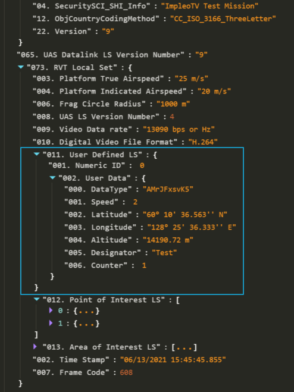

Plugins allow you to extend the functionality of **StPlayer** without modifying the application.

**StPlayer** will look for existing plugins (and try to enumerate and load them) in the `C:\Program Files\ImpleoTV\StPlayer\Bin\x64\plugins` directory (if installed with the defaults).

Installing a new plugin simply requires copying the plugin DLLs into this folder.

You can view installed plugins in **Options > Plugins**

# Using RvtUserDefinedData plugin

Each plugin implements its specific functionality.  
For example, if a user doesn't have the **RvtUserDefinedData** plugin installed, **StPlayer** will show user-defined RVT data as a data buffer.

Once the **RvtUserDefinedData** plugin is copied into plugins directory, the player will be able to decode and present the data:

Compact form: 

Detailed form: 

