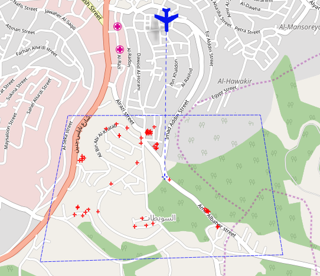
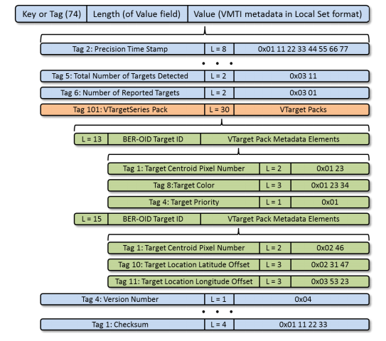
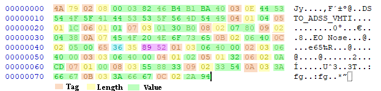

# Getting started with MISB 0903

**MISB ST 0903** defines a metadata standard for tracks and associated indicators of motion for
Motion Imagery. It specifies the constructs for reporting the motions of entities, the history of
their motions, and the types of the entities being reported. In addition, it provides methods to
disseminate the evidential support for inferred movements, tracks, and the characteristics of
entities observed in Motion Imagery. As such, the standard is designed to support a stand-alone
role in Motion Imagery-based analytics, as well as a cooperative, conjunctive analytics role with
other sensor modalities and multi-source methodologies.

**VMTI** in [StPlayer](https://www.impleotv.com/content/stplayer/help/index.html)  

- Video overlay:


- Map overlay  


## Embedding into MISB 0601:  

**MISBCore** library creates 0903.4 VMTI in one of two flavours:  

- MISB 0903.4 compliant payload  
- MISB 0601's nested KLV packet (with tag 74)  



Use **EncodePacket** / **DecodePacket** or **EncodePayload** / **DecodePayload** depending on the required output.

## Creating KLV encoded MISB 0903 (VMTI) packet:  

**VMTI** metadata object can be created from a JSON values that follow the standard hierarchy - simply pass the JSON object to the **EncodePacket** method.  

Create json (as a *string* or *JObject* object).  
For example, below is a basic VMTI metadata with some Local Set (LS) information and one target.  

The json **keys** corresponds to the **tags** in the **MISB ST 0903.4** (Video Moving Target Indicator and Track Metadata) standard and the **values** are the metadata values. 

```c#
string jsonVmti = 
    @"{
        2: 'April 19 2001 04:25:21 GMT',
        3: 'DSTO_ADSS_VMTI',
        4: 4,
        5: 28,
        6: 1,
        7: 78000,
        8: 1920,
        9: 1080,
        10: 'EO Nose',
        11: 12.5,
        12: 10.0,  
        101: [
        {
            id: 1234,
            1: 409600,
            2: 409600,
            3: 409600,
            4: 2,
            5: 50,
            6: 2765,
            7: 0,
            8: 5605427,
            9: 13140,
            10: 10.0,
            11: 10.0,
            12: 10000.0
        }
        ]
    }";
```

> Make sure the values are in the range defined in a standard.

Let's encode it as a nested MISB 0601 packet (with outer tag 74).  
Create MISB903 instance and call **EncodePacket** method.

```c#
// Create MISB903 instance
var misb903 = new MISB903();
// Decode packet
var buf = misb903.EncodePacket(jsonVmti);
```

**That's it!** We've received a buffer with the encoded data.


## Decoding KLV encoded MISB 903 packet:  
Decoding a buffer with MISB903 KLV data is also very simple. Just provide your buffer to decoder...

```c#
// Get your KLv encoded MISB metadata buffer (from file, demultiplexer, etc) 
var buf = File.ReadAllBytes( @"C:\Tmp\vmtiPckt.bin");

// Create MISB601 instance
MISB601 misb601 = new MISB601();
// Decode packet
var pckt = misb601.DecodePacket(buf);
```

## JSON serialization:  

**DecodePacket** returns the Newtownsoft (json.net) **JObject** format which is very handy for data manipulation.   
If you need **JSON**, just call **ToString();** method to serialize it.  
For example, in order to get the formatted json, call 

```c#
var json = pckt.ToString();
```

You'll get the JSON:

```js
{
  "2": 987665121000000,
  "3": "DSTO_ADSS_VMTI",
  "4": 4,
  "5": 28,
  "6": 1,
  "7": 78000,
  "8": 1920,
  "9": 1080,
  "10": "EO Nose",
  "11": 12.5,
  "12": 10.0,
  "101": [
    {
      "id": 1234,
      "1": 409600,
      "2": 409600,
      "3": 409600,
      "4": 2,
      "5": 50,
      "6": 2765,
      "7": 0,
      "8": 5605427,
      "9": 13140,
      "10": 10.0,
      "11": 10.0,
      "12": 10000.0
    }
  ]
}
```

## Binary data
**MisbCore** uses **base64** encoded strings to encode and decode binary data. For example, to encode a JPEG image (VChip tag 105), the image data must be passed as a **base64** encoded string. Upon decoding, the binary data of the VChip's JPEG image will be returned in **JSON** format, also as a **base64** encoded string. For example:  
```js
...
"105": {
			"1": "png",
			"3": "iVBORw0KGgoAAAANSUhEUgAAACAAAAAgCAYAAABzenr0AAAABmJLR0QA/wD/AP+gvaeTAAAA3ElEQVRYw+1XQQqEMAychOAL8pE9+P8n7BvqSSro1YtmT7ugUGTbarusuRRaSIZhJmnIzAwFg1E4igOQ/QXhcWpBw7NyBkJIUyPErHyfiQ44tjwMRBU5Anfb8CwAy7Lkd8FRwXEc4b1H13VQVbRtex0D0zSh73s45+C9R9M01zKgqlBVEBGGYYCIlNUARdjvtmFWACl/Gs7h/5Q+kARgnufNGSXg/Z/wPTaD45joM4zWdQURwczAzJu30Dje55UkATH/vg0lsvMUBJB5jbg7Yb0iPHtBqYYB+vvt+AWIS1B2UlmDeQAAAABJRU5ErkJggg=="
}
```

## Creating metadata manually

Here is an example of dynamic metadata object creation using **Json.net**  

```c#
// Create Local set data
var vmti = new JObject();
vmti.Add(VMTI_LocalSetTagStr.UNIX_Time_Stamp, DateTime.ParseExact("April 19 2001 04:25:21 GMT", "MMMM dd yyyy HH:mm:ss Z", CultureInfo.InvariantCulture));
vmti.Add(VMTI_LocalSetTagStr.System_Name, "DSTO_ADSS_VMTI");
vmti.Add(VMTI_LocalSetTagStr.LDS_Version_Number, 4);
vmti.Add(VMTI_LocalSetTagStr.TotalNumberOfTargets, 28);
vmti.Add(VMTI_LocalSetTagStr.NumberOfReportedTargets, numberOfTargets);
vmti.Add(VMTI_LocalSetTagStr.VideoFrameNumber, 78000);
vmti.Add(VMTI_LocalSetTagStr.FrameWidth, 1920);
vmti.Add(VMTI_LocalSetTagStr.FrameHeight, 1080);
vmti.Add(VMTI_LocalSetTagStr.Source_Sensor, "EO Nose");
vmti.Add(VMTI_LocalSetTagStr.Sensor_Horizontal_FOV, 12.5);
vmti.Add(VMTI_LocalSetTagStr.Sensor_Vertical_FOV, 10.0);

int numberOfTargets = 2;
var vTargetSeries = new JArray();
// Create Target Packets
for (int i = 0; i < numberOfTargets; i++)
{
    var vTargetPack = new JObject();
    vTargetPack.Add(VMTI_TargetPackTagStr.Id, 1234 + i);
    vTargetPack.Add(VMTI_TargetPackTagStr.TargetCentroidPixel, 409600);
    vTargetPack.Add(VMTI_TargetPackTagStr.BoundingBoxTopLeftPixel, 409600);
    vTargetPack.Add(VMTI_TargetPackTagStr.BoundingBoxBottomRightPixel, 409600);
    vTargetPack.Add(VMTI_TargetPackTagStr.TargetPriority, 2);
    vTargetPack.Add(VMTI_TargetPackTagStr.TargetConfidenceLevel, 50);
    vTargetPack.Add(VMTI_TargetPackTagStr.NewDetectionFlag, 2765);
    vTargetPack.Add(VMTI_TargetPackTagStr.PercentageOfTargetPixels, i);
    Int32 color = Color.FromArgb(0x55, 0x88, 0x33).ToArgb() & 0x00FFFFFF;
    vTargetPack.Add(VMTI_TargetPackTagStr.TargetColor, color);
    vTargetPack.Add(VMTI_TargetPackTagStr.TargetIntensity, 13140);
    vTargetPack.Add(VMTI_TargetPackTagStr.TargetLocationLatOffset, 10);
    vTargetPack.Add(VMTI_TargetPackTagStr.TargetLocationLonOffset, 10);
    vTargetPack.Add(VMTI_TargetPackTagStr.TargetHeight, (10000 + (i * 10)));
    vTargetPack.Add(VMTI_TargetPackTagStr.BoundingBoxTopLeftLatOffset, 10);
    vTargetPack.Add(VMTI_TargetPackTagStr.BoundingBoxTopLeftLonOffset, 10);
    vTargetPack.Add(VMTI_TargetPackTagStr.BoundingBoxBottomRightLatOffset, 10);
    vTargetPack.Add(VMTI_TargetPackTagStr.BoundingBoxBottomRightLonOffset, 10);

    var tLocation = new JArray(43, 110, 10000, 300, 200, 100, 0.75, 0.5, 0.25);
    vTargetPack.Add(VMTI_TargetPackTagStr.Target_Location, tLocation);

    // Add tracker
    var vTracker = new JObject();
    vTracker.Add(VMTI_VTrackerLocalSetTagStr.DetectionStatus, 1);
    vTracker.Add(VMTI_VTrackerLocalSetTagStr.StartTimeStamp, DateTime.ParseExact("April 19 2001 04:25:21 GMT", "MMMM dd yyyy HH:mm:ss Z", CultureInfo.InvariantCulture));
    vTracker.Add(VMTI_VTrackerLocalSetTagStr.EndTimeStamp, DateTime.ParseExact("April 19 2001 04:25:21 GMT", "MMMM dd yyyy HH:mm:ss Z", CultureInfo.InvariantCulture));
    vTracker.Add(VMTI_VTrackerLocalSetTagStr.Algorithm, "test");
    vTracker.Add(VMTI_VTrackerLocalSetTagStr.Confidence, 50);

    int numberOfPoints = 4;
    vTracker.Add(VMTI_VTrackerLocalSetTagStr.NumberOfPoints, numberOfPoints);
    var Locus = new JArray();
    for (uint j = 0; j < numberOfPoints; j++)
        Locus.Add(new JArray(43 + j * 0.001, 110 + j * 0.001, 10000, 300, 200, 100, 0.75, 0.5, 0.25));

    vTracker.Add(VMTI_VTrackerLocalSetTagStr.Locus, Locus);

    var velocity = new JArray(300, 200, 100, 300, 200, 100, 0.75, 0.5, 0.25);
    vTracker.Add(VMTI_VTrackerLocalSetTagStr.Velocity, velocity);

    var acceleration = new JArray(300, 200, 100, 300, 200, 100, 0.75, 0.5, 0.25);
    vTracker.Add(VMTI_VTrackerLocalSetTagStr.Acceleration, acceleration);

    vTargetPack.Add(VMTI_TargetPackTagStr.VTracker_LDS, vTracker);

    // Add Target Pack to TargetPackSeries array
    vTargetSeries.Add(vTargetPack);
}

vmti.Add(VMTI_LocalSetTagStr.VTargetSeries, vTargetSeries);
```

This will create a JSON:

```js
{
    "2": "2001-04-19T07:25:21+03:00",
    "3": "DSTO_ADSS_VMTI",
    "4": 4,
    "5": 28,
    "6": 2,
    "7": 78000,
    "8": 1920,
    "9": 1080,
    "10": "EO Nose",
    "11": 12.5,
    "12": 10.0,
    "101": [
      {
        "id": 1234,
        "1": 409600,
        "2": 409600,
        "3": 409600,
        "4": 2,
        "5": 50,
        "6": 2765,
        "7": 0,
        "8": 5605427,
        "9": 13140,
        "10": 10,
        "11": 10,
        "12": 10000,
        "13": 10,
        "14": 10,
        "15": 10,
        "16": 10,
        "104": {
          "2": 1,
          "3": "2001-04-19T07:25:21+03:00",
          "4": "2001-04-19T07:25:21+03:00",
          "6": "test",
          "7": 50,
          "8": 4,
          "9": [
            [ 43.0, 110.0, 10000, 300, 200, 100, 0.75, 0.5, 0.25 ],
            [ 43.001, 110.001, 10000, 300, 200, 100, 0.75, 0.5, 0.25 ],
            [ 43.002, 110.002, 10000, 300, 200, 100, 0.75, 0.5, 0.25 ],
            [ 43.003, 110.003, 10000, 300, 200, 100, 0.75, 0.5, 0.25 ]
          ],
          "10": [ 300, 200, 100, 300, 200, 100, 0.75, 0.5, 0.25 ],
          "11": [ 300, 200, 100, 300, 200, 100, 0.75, 0.5, 0.25 ]
        }
      },
      {
        "id": 1235,
        "1": 409600,
        "2": 409600,
        "3": 409600,
        "4": 2,
        "5": 50,
        "6": 2765,
        "7": 1,
        "8": 5605427,
        "9": 13140,
        "10": 10,
        "11": 10,
        "12": 10010,
        "13": 10,
        "14": 10,
        "15": 10,
        "16": 10,
        "104": {
          "2": 1,
          "3": "2001-04-19T07:25:21+03:00",
          "4": "2001-04-19T07:25:21+03:00",
          "6": "test",
          "7": 50,
          "8": 4,
          "9": [
            [ 43.0, 110.0, 10000, 300, 200, 100, 0.75, 0.5, 0.25 ],
            [ 43.001, 110.001, 10000, 300, 200, 100, 0.75, 0.5, 0.25 ],
            [ 43.002, 110.002, 10000, 300, 200, 100, 0.75, 0.5, 0.25 ],
            [ 43.003, 110.003, 10000, 300, 200, 100, 0.75, 0.5, 0.25 ]
          ],
          "10": [ 300, 200, 100, 300, 200, 100, 0.75, 0.5, 0.25 ],
          "11": [ 300, 200, 100, 300, 200, 100, 0.75, 0.5, 0.25 ]
        }
      }
    ]
}
```
