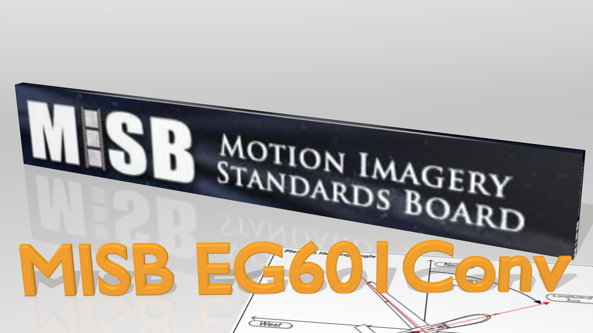

# MisbCore SDK

**MisbCore SDK** - KLV / MISB metadata encoder / decoder (*.Net* / or optional [64 bit Native library for x64 or arm64](./user-guide/native-lib.md))

* KLV - SMPTE 336M-2007
* STANAG 4609 MISB metadata
* MISB 0601 - UAS Datalink Local Set
* MISB 0102 - Security Metadata Local Set
* MISB 0806 - Remote Video Terminal (RVT)
* MISB 0903 - Video Moving Target Indicator and Track Metadata*
* MISB 1204 - Motion Imagery Identification System (MIIS)
* MISB 1601 - Geo-Registration Local Set*

* *ITAR free*

 *** *Partial implementation*

The **MisbCore SDK** .NET SDK is compatible with both Microsoft .NET Framework and Microsoft .NET Core runtimes.

[Getting started with MisbCore SDK](./user-guide/getting-started.md).
___

For more info please visit [ImpleoTV website](https://www.impleotv.com).
