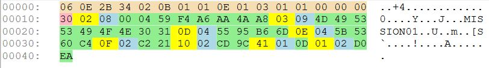

# Decoding KLV encoded MISB 601 packets

**MisbCore SDK** decoder accepts byte arrays containing MISB KLV encoded metadata and decodes them to JSON (object or string), preserving their nested data hierarchy.

There are two options (of the data source):  

* Entire packet buffer, that contains the higher level (outer) key, length, and data payload  
* Data payload only.

## Decoding KLV encoded MISB 601 packets to JObject

Decoding RAW  KLV with **MisbCore SDK** is very straightforward - you create the instance of the class that represents the required MISB standard and call **DecodePacket** (or **DecodePayload**) passing the data buffer.

Let's assume we have a buffer with a RAW Klv that was demultiplexed from a STANAG4609 stream:  

  
The above buffer contains the following parts:  
  
* The UAS Local Set 16-Byte UL “Key”-<small><span style="background-color:PeachPuff">0x06 0x0E 0x2B 0x34 0x02 0x0B 0x01 0x01 0x0E 0x01 0x03 0x01 0x01 0x00 0x00 0x00</span></small> 
* Packet length - <span style="background-color:Plum">0x30</span> 
* Packet data payload - Klv triplets: <span style="background-color:yellow">tag</span>, <span style="background-color:Lavender">length</span> and <span style="background-color:LightGreen">value</span>
* Checksum  (last klv triplet, last 4 bytes)


```C#
// Get your KLv encoded MISB metadata buffer (from file, demultiplexer, etc) 
var buf = File.ReadAllBytes( @"C:\Tmp\misb601pckt.bin");

// Create MISB601 instance
var misb601 = new MISB601();
// Decode packet
var pckt = misb601.DecodePacket(buf);
```

The result of the decoding is a JObject.   

```js
{
  "2": "2008-10-24T00:13:29.913Z",
  "3": "MISSION01",
  "13": 60.176822967,
  "14": 128.426759042,
  "15": 14190.72,
  "16": 144.5713,
  "65": 13,
  "1": 53482
}
```

We can now do the required processing or serialize it to json string:  

```C#
var jsonStr = decodedPckt.ToString();
Console.WriteLine(jsonStr);
```

## Options

**MisbCore SDK** has several configuration options you can use to fine-tune its behavior.

- **TimeStampAsDateTime** property - set it to **true** in order to get the timestamps in a **ISO 8601** format. Default - *false*
- **RoundValues** property - set it to **true** in order to get the values rounded to the accuracy defined in the standard. Default - *true*
- **OrderByTags** property - set it to **true** in order to sort the elements of a klv items sequence in ascending order, according to a tag. Default - *false*


### Raw Klv  

**MisbCore SDK** provides an option for extraction of the **RAW klv** items (tag/value buffer). This can be especially useful for data manipulation where you need the original klvs.  
There are some additional benefits of using RAW Klv for data manipulation:  

* No "generation loss" when you have to re-encode compressed values, without changing them
* Lower CPU usage, as no MISB decoding / Encoding is performed  

**RAW klv** is presented as an array of klv items.

```cs
    /// <summary>
    /// KlvItem - Raw Klv item
    /// </summary>
    public class KlvItem
    {
        public ushort Tag { get; set; }  
        public byte[] Value { get; set; }

        public KlvItem(ushort tag, byte [] value)
        {
            this.Tag = tag;
            this.Value = value;
        }
    }
```

Use **LastDecodedKlvItemArr** method to get an array or **LastDecodedKlvItemList** method to get a List<KlvItem>.

```cs
var misb601 = new MISB601();
// Decode packet
var pckt = misb601.DecodePacket(buf);
KlvItem[] klvItems = misb601.LastDecodedKlvItemArr();
```

In case you only need **RawKlv** items, without **MISB** decoding you can use **DecodePacketRawKlv** method.
 
```cs
var misb601 = new MISB601();
// Decode packet
var decodedPckt = misb601.DecodePacketRawKlv(buf);
```

### Partial Raw Klv decoding

There are some very specific cases where you may need to process only part of the data. For instance, you only need some specific lower tags or some invalid encoder vendor implementation prevents you from decoding the entire buffer and you still need to save what is possible. **DecodePacketPartialRawKlv** may help you with this. When you specify **cutOffTag** parameter, the function aborts decoding after this **tag** is reached, effectively ignoring the rest of the buffer.

```cs
List<KlvItem> DecodePacketPartialRawKlv(byte[] buf, int offset, ushort cutOffTag, out int cutOffIndex )
```

>You may need to disable Klv Checksum validation to allow packet processing.

## Helper functions

There are some helper functions available that can be useful for Klv data processing tasks.

###  FilterSpecialValues

**FilterSpecialValues** will filter out all "Out of Range", "Reserved" and "Off Earth" (0x8000 / 0x80000000) items from the packet. This is sometimes useful for map presentation, etc.

```cs
JObject FilterSpecialValues(JObject pckt)
```
### GeoJSON

**GeoJSON** is a format for geographic data representation. It is based on the JSON format.
To create a **GeoJSON** from MISB 601 packet, call

```cs
 var geoJson = MISB601.ConvertToGeojson(pckt601);
```

## Supported tags
[Supported MISB 601 tags](./st601-supported.md) 